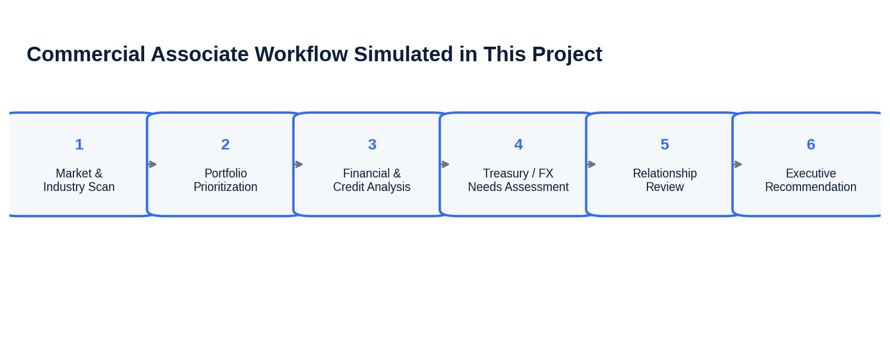
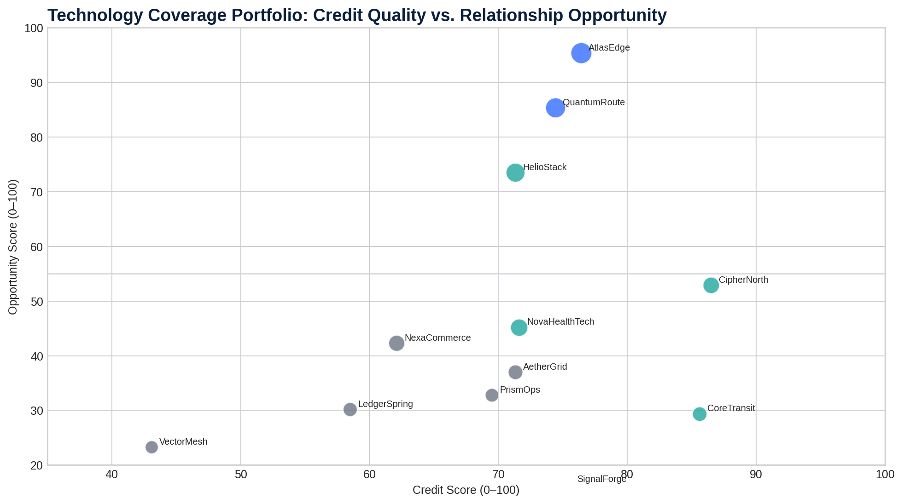
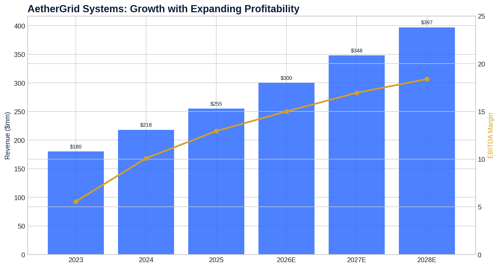
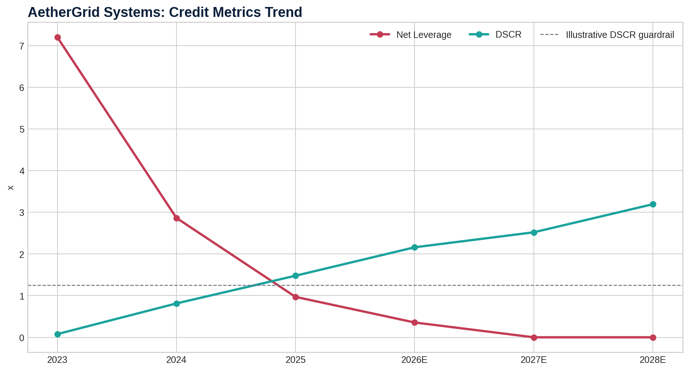
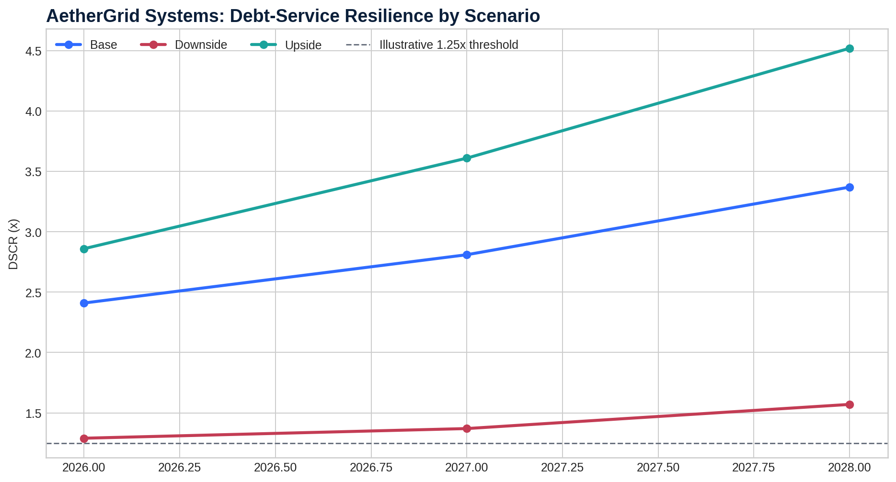
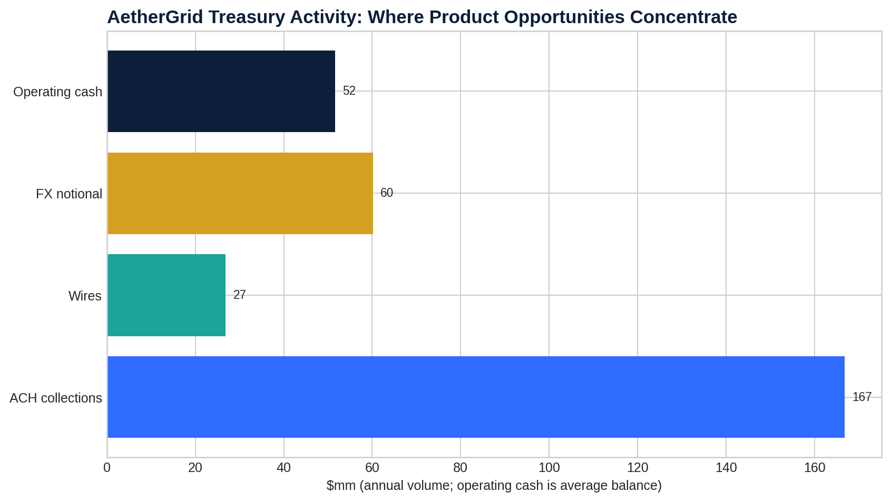

# Transformative Technology Commercial Banking Coverage & Credit Strategy Platform



## Executive Summary

This repository is an **independent, synthetic commercial-banking simulation** designed to demonstrate the work of a Commercial Associate supporting a technology-focused middle-market coverage team. It is not Bank of America work product, does not use confidential bank data, and does not represent an actual credit approval.

The project recreates the core responsibilities of a technology commercial-banking associate:

- analyze market and industry data for client/prospect discussions;
- prioritize a portfolio of technology clients and prospects;
- interpret corporate financial and cash-flow statements;
- evaluate leverage, liquidity, debt-service capacity, and downside resilience;
- identify treasury, payments, FX, and liquidity-management opportunities;
- prepare relationship-review and executive-presentation materials;
- coordinate a recommendation across credit, treasury, and relationship-management perspectives.

Bank of America publicly describes Global Commercial Banking as serving middle-market companies with roughly **$50 million to $2 billion of annual revenue** and delivering integrated solutions across treasury, lending, leasing, advisory, risk management, and capital markets. This simulation intentionally uses fictional companies within that coverage range.

## Project Objective

Build an executive-ready coverage and credit platform that answers five questions:

1. **Which technology clients and prospects deserve immediate coverage attention?**
2. **What does the flagship client's financial condition say about credit quality?**
3. **How resilient is debt service under a downside scenario?**
4. **Where can the relationship be deepened through treasury, payments, FX, and liquidity solutions?**
5. **What should a Relationship Manager and product partners do next?**

## Scope

### Portfolio Layer
A synthetic portfolio of 12 middle-market technology companies spanning:

- Cloud / AI observability
- Cybersecurity
- Fintech infrastructure
- AI data infrastructure
- Vertical SaaS
- Cloud services
- Commerce enablement
- Network software
- DevOps / automation
- Healthcare technology
- Data & analytics
- Edge computing

The portfolio model scores each company on credit quality, relationship opportunity, and coverage priority.



### Flagship Client Deep Dive: AetherGrid Systems
AetherGrid Systems is a fictional cloud / AI observability software company used for the detailed client relationship review.

The analysis includes:

- 2023–2025 historical financials
- 2026E–2028E base-case forecast
- recurring revenue and retention trends
- profitability and free-cash-flow progression
- liquidity and leverage analysis
- debt-service coverage
- downside and upside scenarios
- treasury activity assessment
- FX and international-revenue exposure
- relationship-expansion recommendations



## Key Findings

### Portfolio
- **AtlasEdge Systems** and **QuantumRoute Networks** screen as the highest overall coverage priorities because of their combination of financial strength and estimated relationship wallet.
- **CipherNorth Security** has the strongest underlying credit score among the high-growth prospects, making it an attractive new-business target despite a smaller current wallet estimate.
- **VectorMesh AI** has exceptional growth but weak profitability and cash generation; it should remain a high-touch prospect rather than an immediate credit expansion target.
- The model separates **credit quality** from **commercial opportunity** so that a fast-growing prospect is not automatically treated as a strong borrower.

### AetherGrid
- Revenue grows from **$255MM in 2025 to approximately $397MM in 2028E** in the base case.
- EBITDA margin expands from approximately **13% to 18%+**, supported by operating leverage.
- Base-case DSCR rises above **2.4x in 2026E** and improves thereafter.
- In the modeled downside case, 2026E DSCR falls to roughly **1.29x**, showing limited but still positive cushion above the illustrative 1.25x monitoring threshold.
- International revenue expands from **18% in 2025 to 27% in 2028E**, increasing the relevance of FX and global treasury solutions.
- The relationship recommendation is to **retain / support an illustrative revolving credit facility while expanding treasury, receivables, liquidity, and FX penetration** rather than pursue aggressive incremental term leverage.





## Repository Structure

```text
.
├── README.md
├── data
│   ├── raw
│   │   ├── portfolio_companies.csv
│   │   ├── aethergrid_financials.csv
│   │   └── aethergrid_treasury_activity.csv
│   └── processed
│       ├── portfolio_metrics.csv
│       └── aethergrid_scenarios.csv
├── models
│   └── Transformative_Technology_Commercial_Banking_Model.xlsx
├── deck
│   └── Executive_Relationship_Review_AetherGrid.pptx
├── docs
│   ├── executive_summary.md
│   ├── credit_screening_memo.md
│   ├── relationship_review.md
│   ├── methodology.md
│   ├── data_dictionary.md
│   ├── interview_walkthrough.md
│   ├── resume_bullets.md
│   └── sources.md
├── images
│   ├── project_workflow.png
│   ├── portfolio_priority_matrix.png
│   ├── aethergrid_growth_profitability.png
│   ├── aethergrid_credit_metrics.png
│   ├── aethergrid_scenario_dscr.png
│   └── aethergrid_treasury_opportunity.png
└── src
    ├── generate_data.py
    ├── credit_model.py
    ├── portfolio_scoring.py
    └── sql
        └── coverage_queries.sql
```

## Analytical Methodology

### 1. Credit Score
The portfolio credit score combines:

| Factor | Weight |
|---|---:|
| Revenue growth | 12% |
| EBITDA margin | 18% |
| Free-cash-flow margin | 18% |
| Net leverage | 22% |
| Current ratio | 14% |
| Net revenue retention | 8% |
| Risk flags | 8% |

The score is intentionally **not a bank risk rating**. It is a transparent analytical screen for the project.

### 2. Opportunity Score
The opportunity score combines:

- estimated annual relationship wallet; and
- international-revenue exposure as a proxy for treasury / FX complexity.

### 3. Coverage Priority Score

```text
Coverage Priority = 65% × Credit Score + 35% × Opportunity Score
```

### 4. Flagship Credit Metrics

```text
Gross Margin = Gross Profit / Revenue
EBITDA Margin = EBITDA / Revenue
FCF Margin = Free Cash Flow / Revenue
Net Leverage = (Debt - Cash) / EBITDA
Current Ratio = Current Assets / Current Liabilities
DSCR = Cash Available for Debt Service / (Interest + Scheduled Principal)
```

### 5. Scenario Analysis
Three cases are modeled:

- **Base** — continued double-digit growth and moderate margin expansion;
- **Downside** — slower growth, compressed profitability, and higher rates;
- **Upside** — stronger growth, faster operating leverage, and lower rates.

The downside case is designed to test debt-service resilience rather than predict an actual recession.

## Treasury & Relationship Strategy

The treasury assessment reviews customer collections, vendor payments, wire activity, ACH activity, foreign-exchange notional, and average operating cash.



The relationship opportunity map includes:

- operating deposits and liquidity management;
- receivables automation / ACH collection workflows;
- wire and vendor-payment controls;
- foreign-exchange risk management;
- commercial card / expense solutions;
- working-capital and revolving-credit support;
- referral opportunities to investment-banking or wealth partners when appropriate.

## Executive Recommendation

For AetherGrid Systems, the simulated recommendation is:

**Credit:** Support continuation of an illustrative $50MM revolving facility, subject to customary underwriting, documentation, and formal approval. Avoid aggressive incremental term leverage until the company demonstrates sustained margin expansion and downside DSCR cushion.

**Treasury:** Prioritize receivables automation, operating-liquidity management, payment controls, and global cash visibility.

**FX:** Begin a formal exposure review as international revenue approaches one-quarter of total revenue.

**Relationship Management:** Schedule a strategic relationship review with the CFO / Treasurer centered on growth financing, liquidity architecture, international expansion, and operating efficiency.

## How to Present This Project in an Interview

Do not describe this as actual Bank of America work. Present it as:

> “I built an independent commercial-banking simulation to practice the responsibilities of a technology coverage associate. I created a synthetic middle-market technology portfolio, prioritized client and prospect opportunities, built a detailed financial and credit model for a flagship SaaS client, tested debt-service capacity under downside scenarios, assessed treasury and FX needs, and translated the analysis into an executive relationship review.”

See [`docs/interview_walkthrough.md`](docs/interview_walkthrough.md) for the full presentation script.

## Disclaimer

All company names, financial statements, client activities, facility terms, risk scores, and relationship estimates in this repository are fictional and created solely for portfolio demonstration. Public market and banking sources are cited only to establish external context. This project does not reproduce Bank of America proprietary models, policies, risk-rating systems, pricing, or internal approval processes.
